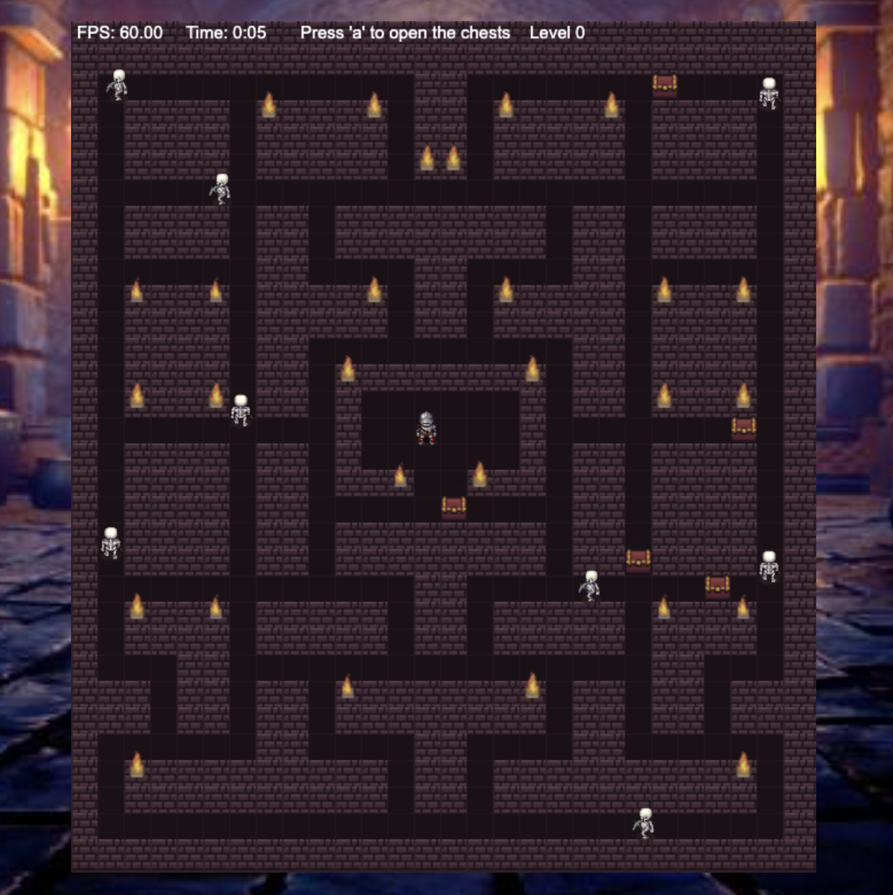

# DUNGEON {

[TRY HERE! 🚀](https://heroku-dungeon.herokuapp.com/)


<p align="center">
  
</p>

## Table of Contents

1. [Technologies](#technologies)
1. [About the game](#about-the-game)
1. [Set Up](#set-up)
1. [Commands Availables](#commands-availables)
1. [Keymap](#keymap)
1. [Project tree](#project-tree)
1. [Honorable mentions](#project-tree)

# Technologies

- [NodeJS](https://nodejs.org/)
- [yarn](https://classic.yarnpkg.com/en/)
- [Typescript](https://www.typescriptlang.org/)
- [Eslint](https://eslint.org/)

## About the game

An amazing and exciting maze game inspired on classic Pacman for the CORE-Code School bootcamp project!

## Set Up

To download and start the project you need to run the following commands:

```bash
# Clone the project into your local pc
git clone https://github.com/amargopastor/dungeon.git

# Move into it
cd dungeon

# Install all the necessary dependencies (you can check them in the package.json)
yarn install
```

## Commands Availables

Once you've set up the project you're ready to run develop or test the game. Here there are different options.

```bash
# Start the project (build the game and runs index.html)
npm start || npm run start

# Start the project in dev mode (runs typescript files)
yarn run dev

# Clean the old files (removes docs, dist and .parcel-cache directories)
npm run clean

# Creates a build prepared to be loaded in GitHub Pages
npm run ghbuild

# Build the game (removes build folder -> builds game with ghbuild)
npm run build
```

## Keymap

| Move       | Player 1 |
| ---------- | -------- |
| Up         | ⬆        |
| Right      | ➡        |
| Down       | ⬇        |
| Left       | ⬅        |
| Open chest | A        |

## Project tree

```
dungeon
├─ .eslintrc.json
├─ index.html
├─ package-lock.json
├─ package.json
├─ public
│  ├─ assets
│  │  ├─ audioeffects
│  │  │  ├─ action-dooropen01.wav
│  │  │  ├─ action-doorshut01.wav
│  │  │  └─ ambience-creepyatmosfear.wav
│  │  └─ maps
│  │     └─ mapsArray.ts
│  ├─ css
│  │  └─ styles.css
│  └─ images
│     ├─ background.jpeg
│     ├─ dungeonStuffs1.png
│     ├─ dungeonStuffs2.png
│     ├─ dungeonStuffs3.png
│     ├─ dungeonStuffs4.png
│     ├─ dungeonWalls1.png
│     ├─ dungeonWalls2.png
│     ├─ hero.png
│     ├─ link.png
│     ├─ readme_img.png
│     └─ skeleton.png
├─ src
│  ├─ actors
│  │  ├─ Actor.ts
│  │  ├─ AudioStatus.ts
│  │  ├─ Chest.ts
│  │  ├─ ChestManager.ts
│  │  ├─ Chronometer.ts
│  │  ├─ FPSViewer.ts
│  │  ├─ Foe.ts
│  │  ├─ FoeManager.ts
│  │  ├─ Hero.ts
│  │  ├─ Map.ts
│  │  └─ UpperMessage.ts
│  ├─ app.ts
│  ├─ effects
│  │  ├─ AudioManager.ts
│  │  └─ DrawManager.ts
│  ├─ state
│  │  └─ GameManager.ts
│  ├─ types
│  │  ├─ Level.ts
│  │  └─ Point.ts
│  └─ utils
│     ├─ angleToRad.ts
│     ├─ checkLimits.ts
│     └─ keyBoardMap.ts
└─ tsconfig.json
```

## Honorable mentions

- 🍍

**[⬆ back to top](#table-of-contents)**
